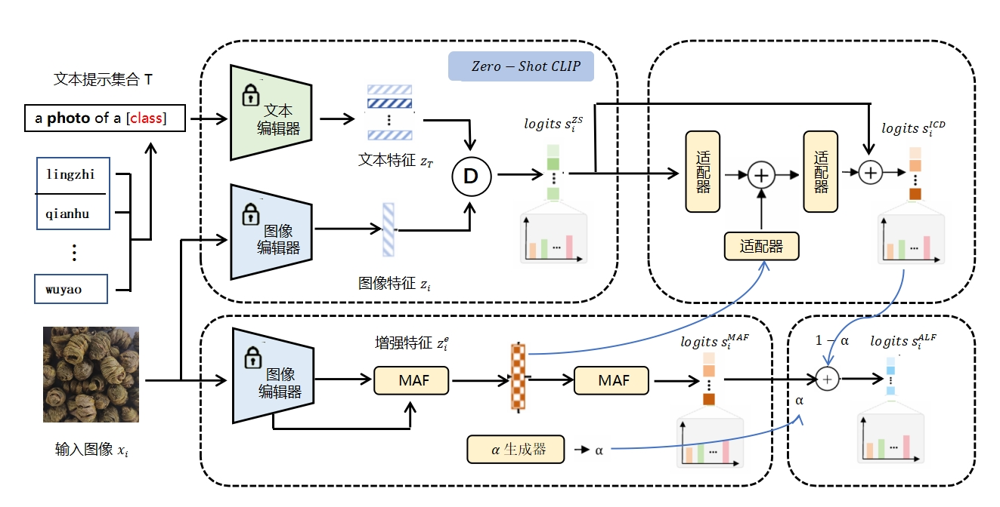
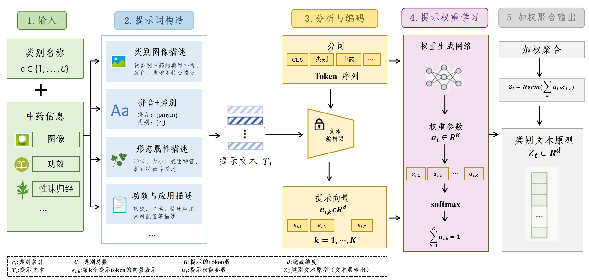
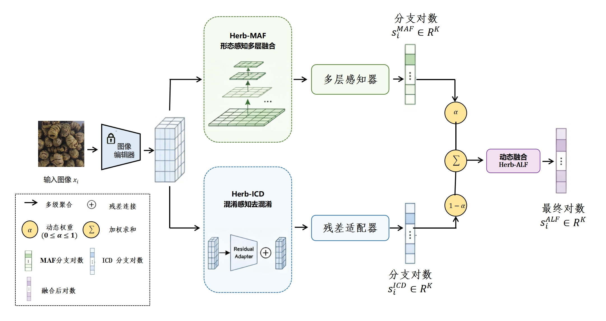

# HerbVLM

一种图文知识增强的中药材鉴别模型。

## 模型简介

HerbVLM 以 CLIP 为基础，在中药材识别任务上引入了针对中药文本提示与特征融合的改进模块，核心目标是提升细粒度中药材类别的识别准确率与鲁棒性。

- 视觉分支（HIA）：提取药材图像特征
- 文本分支(TKPM)：使用中药类别名称与元信息提示构建文本特征
- 融合策略：通过适配器与动态融合机制完成最终分类

## 模型结构图

### 1) HerbVLM 总体结构



### 2) TKPM 文本层知识提示模块



### 3) HIA 图像层融合机制



## 当前仓库

```text
HerbVLM/
├── clip_herbvlm/                         # 模型核心实现
├── datasets/
│   ├── chinese_medicine_163.py       # 中药材数据集定义
│   ├── utils.py
│   └── jsons/
│       ├── chinese_medicine_163_text_meta.json
│       └── chinese_medicine_163_text_meta.example.json
├── assets/                           # README 图示
├── model/clip/README.md              # 预训练权重说明
├── herbvlm_train.py                      # 训练入口
├── requirements.txt
└── .gitignore
```

## 环境安装

```bash
cd HerbVLM
python -m venv .venv
source .venv/bin/activate
pip install -U pip
pip install -r requirements.txt
```

## 数据组织

设置 `HERBVLM_DATA_ROOT` 后，数据目录需满足：

```text
$HERBVLM_DATA_ROOT/
└── Chinese-Medicine-163/
    ├── train/
    └── test/
```

## 训练

```bash
export HERBVLM_DATA_ROOT=/path/to/your/data
export HERBVLM_MODEL_CACHE_DIR=./model/clip
export HERBVLM_TARGET_DATASET=chinese_medicine_163
export HERBVLM_MODEL_VARIANT=herbvlm
export HERBVLM_BACKBONE=ViT-B/16
export HERBVLM_EPOCHS=20
export HERBVLM_BATCH_SIZE=64
export HERBVLM_SHOTS=-1
export HERBVLM_TEXT_PROMPT_MODE=multi
export HERBVLM_TEXT_META_JSON=datasets/jsons/chinese_medicine_163_text_meta.json

python herbvlm_train.py
```

## 输出

- 日志：`result/log/`
- 检查点：`result/checkpoints/`
- 可视化：`result/vis/`
